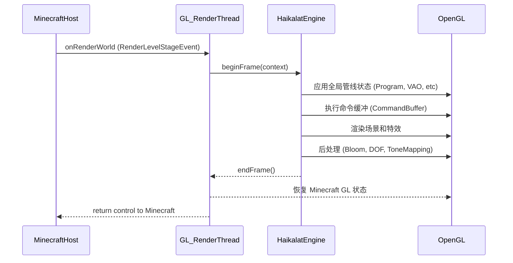

# HaikalatHost Minecraft 适配层报告

> **历史文档：** 本文是旧方案存档，不再作为实现依据。当前薄宿主契约和第三方扩展入口见
> [haikalathost-0.20.md](haikalathost-0.20.md) 与 [quickstart.md](quickstart.md)。

**执行摘要：** HaikalatHost 模块负责将 Minecraft 客户端与 Haikalat 通用引擎联通，实现生命周期管理、资源桥接、相机/帧缓冲/深度数据导入、OpenGL 状态隔离、事件和网络同步、玩家与实体适配、UI 宿主等功能。目标是让 Haikalat 在 Minecraft 环境中无缝工作，同时提供面向模组开发者的易用 API。以下建议重点区分 Haikalat（通用引擎）与 Host（Minecraft 适配）职责，按优先级给出实施步骤和可验收方案：

## Host 的 OpenGL 4.6 前提

HaikalatHost 不负责提供 OpenGL 3.x 兼容后端。它必须复用 Minecraft 已有窗口和 Render Thread，并在 Haikalat GPU 初始化前确认当前 Context 已经满足 OpenGL 4.6 Core。若项目通过 FractureLoader 修改窗口创建参数或完成 Context 交接，该过程属于启动层职责；Host 只接受已经可用的 4.6 Context。验证失败时应显示缺失版本、扩展和驱动信息，然后停止 Haikalat runtime 初始化。

这项硬件基线不等于全接管 Minecraft 渲染器。Minecraft 仍可继续管理自己的正常画面；Host 只需要在共享 Context 中建立清晰的 GL 状态边界，并让 Haikalat 渲染注册给它的模型、动画、VFX、后处理和 UI。


- **清晰职责划分**：所有与 Minecraft 特殊逻辑相关的功能由 Host 负责（如读取玩家状态、注册实体渲染器、资源管理等），Haikalat 自身仅暴露通用接口。  
- **生命周期集成**：在 Forge/NeoForge 客户端启动时创建 Haikalat `HostedRenderRuntime`，在每帧渲染钩子中调用其 `render()` 方法，再恢复 Minecraft GL 状态。  
- **API 设计**：Host 对外提供简易注册接口（如注册实体渲染器、物品特效、UI 页面等），拦截对应事件触发调用 Haikalat 对象。  
- **OpenGL 4.6 宿主要求**：HaikalatHost 必须在启动早期确认 Minecraft 当前 OpenGL Context 满足 4.6 Core 以及 Haikalat 的硬能力集合。若 FractureLoader 或其他启动层负责提高 Context 版本，Host 只消费交接后的 Context；检查失败时应阻止进入 Haikalat 模式并输出完整 capability 报告。Fabulous、Shader Mod 和自定义 FBO 仍需通过外部资源导入与状态边界处理。  
- **迁移策略**：逐步重构“全接管”原型，将其中可复用逻辑抽象到 Host，冻结或弃用侵入性代码。通过表格分析现有类并决定保留、迁移或删除。

## 关键职责清单与实现建议

- **生命周期管理**：  
  - 在客户端生命周期中创建 Hosted Runtime 的 CPU 侧控制对象；GPU 资源只能在 Minecraft 已有的 Render Thread、且 OpenGL 4.6 Context 已经就绪后初始化。Host **不得**创建第二个 `GlfwWindow`、不得启动抢占 Context 的专用 GL 线程。  
  - 在主渲染循环（如 Forge 的 `RenderLevelStageEvent`）中调用 Haikalat 的 `beginFrame()`、`render()`、`endFrame()`。示例：  
    ```java
    @Mod.EventBusSubscriber(bus=Bus.FORGE, value=Dist.CLIENT)
    public class HaikalatRuntimeController {
        @SubscribeEvent
        public static void onRenderWorld(RenderLevelStageEvent evt) {
            // 构建 HostedFrameContext（相机、时间、帧编号等）
            HostedFrameContext ctx = collectFrameContext(evt);
            HostedRuntime.render(ctx);
        }
    }
    ```  
  - **优先级：高**（P0），**验收条件：** Minecraft 游戏正常进入后，Haikalat 的渲染管线能够被定时调用而不导致崩溃。

- **资源桥接**：  
  - 实现 `ResourceSource` 接口，使 Haikalat 可以加载 Minecraft 资源。Host 应将 `ResourceLocation` 转换为 `AssetId` 并从 `ResourceManager` 读取流。  
  - **示例**：  
    ```java
    public class MinecraftResourceSource implements ResourceSource {
        private final ResourceManager manager;
        public InputStream open(AssetId id) { ... }
        public AssetId resolve(AssetId base, String rel) { ... }
    }
    ```  
  - 处理资源包重载：在 `ResourceManagerReloadEvent` 时通知 Haikalat 刷新缓存。  
  - **优先级：高**（P0），**验收条件：** Haikalat 成功加载模型、纹理、着色器资源，与原版资源路径一致，支持资源包覆盖。

- **相机与帧缓冲导入**：  
  - 获取 Minecraft 主相机信息：通过 `Minecraft.getInstance().gameRenderer.getMainCamera()` 或渲染事件提供的投影矩阵/视图矩阵，封装为 `CameraView`。  
  - 获取当前世界渲染的颜色和深度纹理：例如使用 Forge 的 `ModLoadingContext` 或（Fabulous/Iris）特定 API获取主帧缓冲内容，作为 `ExternalFrameSource` 提供给 Haikalat。  
  - 处理 MSAA：若 Minecraft 主帧缓冲为多样本，需在调用 Haikalat 前做 resolve 操作，确保提供单样本纹理。  
  - **优先级：高**（P0），**验收条件：** Haikalat 能正确获得并使用 Minecraft 渲染的帧色彩和深度信息来进行后处理（如景深、雾等）。

- **OpenGL 状态隔离**：  
  - 在进入 Haikalat 渲染前，用通用状态快照保存当前状态（着色器、VAO、纹理单元、混合/深度/剔除状态等）。完成 Haikalat 渲染后恢复。可调用 Haikalat 的 `StateCache.reset()` 或自定义快照/恢复逻辑。  
  - 考虑 Minecraft 特有缓存：Forge/Blaze3D 的状态可能与实际 GL 状态不同步（如 Minecraft 记录当前着色器编号）。Host 应调用相应 API（如 `RenderSystem.clearError()` 或重设标志）来同步。  
  - **优先级：高**（P0），**验收条件：** 在 Haikalat 绘制后游戏其它内容（UI、方块渲染）不受影响，键鼠输入仍有效，按 F3 等正常显示信息。

- **事件与网络桥接**：  
  - **输入/事件**：将 Minecraft 的按键鼠标事件转换为 Haikalat UI 的 `WindowInputSnapshot` 并传递给 `UiSystem`（Host 可以在 `GuiScreenEvent` 或 `ClientTickEvent` 中收集输入）。  
  - **战斗同步**：对接 Haikalat 动画事件和 Minecraft 的动作协议。例如，当玩家按下攻击键时触发动画播放，并通过自定义数据包向服务端同步动作 ID。服务端验证后广播命中事件（Host 接收后调用 Haikalat VFX）。  
  - **Mod API**：提供注册接口，例如：  
    ```java
    HaikalatMinecraft.registerEntityRenderer(EntityType<?> type,
        (ctx) -> new HaikalatEntityRenderer(ctx, ...));
    ```  
    允许其他模组为自定义实体指定 Haikalat 渲染器。  
  - **优先级：中**（P2），**验收条件：** 键鼠和界面事件在 Haikalat UI 中响应；攻击和技能使用可正确通过动画→VFX→伤害流程联动；API 注册有效。

- **玩家/实体适配**：  
  - 隐藏原版玩家模型：在 `RenderPlayerEvent` 前取消默认渲染。用 Haikalat 的 `SkinnedMeshRenderer` 绘制玩家和视角下臂模型。  
  - 读取玩家状态：从 `LocalPlayer`/`AbstractClientPlayer` 获取移动速度、跳跃、游泳、格挡、瞄准方向等，映射为 `CharacterAnimationInput` 用于动画。  
  - 兼容附加层：鞘翅、披风等可作为 Haikalat 附属模型节点处理。  
  - **优先级：中**（P2），**验收条件：** 玩家在第三/第一人称下姿态自然（已有关节弯曲）；与走路、跳跃动画匹配；客户端 FPS 不显著下降。

- **UI 宿主与输入**：  
  - 实现 Haikalat 自定义 `Screen`，替代或叠加在 Minecraft 原版屏幕上。将 `Window` 类事件转换为 Haikalat 的输入快照传入 `UiSystem`。  
  - HUD 叠加：在游戏主画面渲染后（`RenderGameOverlayEvent`）调用 Haikalat 的 UI 渲染。支持配置 `UiTheme`、自定义字体与图片（通过 Minecraft 资源管理器加载）。  
  - 与原版交互：例如在 Haikalat 窗口中嵌入 Minecraft 物品纹理，可使用 `GuiGraphics.blit` 或直接将 `ItemStack` 渲染到纹理，传给 Haikalat 显示。  
  - **优先级：中**（P2），**验收条件：** 新 GUI 界面（如战斗菜单、配置）能打开并呈现 Haikalat 控件；键鼠、剪贴板和 IME 输入工作正常。

- **常见兼容问题及方案**：  
  - **OpenGL 版本**：Haikalat 模式的硬要求是 OpenGL 4.6 Core。Host 在 runtime 初始化前验证版本、DSA、SSBO、Compute Shader、Image Load/Store、buffer storage、MDI 和 KHR_debug；缺失硬能力时直接拒绝启动 Haikalat runtime，不进行逐功能降级。可选扩展（如 bindless texture）单独标记，不影响基础 runtime。  
  - **帧缓冲**：Fabulous/Optifine 等可能替换主 FBO。Host 应通过 Forge 提供的接口或事件获取当前有效帧缓冲 ID，避免直接使用硬编码值。启用 MSAA 时需显式 Resolve（可借助 FBO blit）。  
  - **Iris/Fabulous**：这些模组在渲染流程可能插入后处理或多重采样逻辑。建议使用 Forge 原生事件（RenderLevelStageEvent）在“全部渲染完成”阶段执行，确保所有原版渲染结束。可参考 [27] 提示：RenderLevelStageEvent 仅在客户端触发。  
  - **Minecraft 状态缓存**：Blaze3D 自身也维护 GL 状态（如当前着色器 ID）。在 Haikalat 渲染完毕后，Host 可调用 `RenderSystem.popAttributes()`（若使用）或手动重置关键状态，确保 Minecraft 后续渲染无误。  
  - **纹理/UV 翻转**：注意 Minecraft 纹理坐标系与 Haikalat 可能不同（屏幕坐标原点）；确保在交互中做相应处理。  

## 模块结构与模组 API 建议

建议 **HaikalatHost** 独立仓库结构示例：  

```
HaikalatHost/
├─ runtime/      # 生命周期管理和渲染钩子
│   ├─ MinecraftHostedRuntimeController.java  # 主控制，接管渲染循环
│   ├─ MinecraftGlStateBridge.java            # GL 状态保存/恢复
│   └─ MinecraftFrameAdapter.java             # 帧上下文封装
├─ resource/     # 资源加载器实现
│   └─ MinecraftResourceSource.java
├─ render/       # 与 Minecraft 渲染管线对接
│   ├─ MinecraftFramebufferSource.java  # 提供主帧缓冲和深度纹理
│   ├─ MinecraftCameraAdapter.java      # 构建 CameraView
│   └─ MinecraftRenderHooks.java        # 事件监听调用代码
├─ player/       # 玩家和实体渲染适配
│   ├─ MinecraftPlayerRenderer.java     # 用 Haikalat 渲染玩家
│   └─ PlayerAnimationInputExtractor.java # 读取玩家状态
├─ combat/       # 战斗动画与同步
│   ├─ MovesetRegistry.java            # 注册技能动作
│   └─ CombatSyncHandler.java          # 网络包和事件
├─ vfx/          # 特效与音效触发桥接
│   ├─ MinecraftEffectWorldQuery.java  # 射线/高度查询
│   └─ MinecraftSoundBridge.java       # 播放游戏音效
└─ ui/           # UI 宿主层
    ├─ HaikalatScreen.java             # Haikalat UI 屏幕适配
    ├─ MinecraftItemWidget.java        # 专用 ItemStack 控件
    └─ InputAdapter.java               # 从 Minecraft 收集输入
```

**模组 API 设计示例：**  
- 注册 Haikalat 实体渲染器：  
  ```java
  public class HaikalatMinecraft {
      public static <T extends Entity> void registerRenderer(EntityType<T> type, Function<RendererFactory<T>, IEntityRenderer<T>> factory) { ... }
  }
  ```  
- 注册技能动作/特效（供其他模组调用），如 `HaikalatAPI.registerMoveset(Item.SWORD, mySlashMovesetAsset)`。  
- UI 页面：`HaikalatAPI.registerScreen(ResourceLocation id, () -> new MyCustomScreen());`  

## 从现有 “全接管” 代码的迁移策略

旧项目若已实现“全接管”架构，需要清晰划分可重用组件：  

| 文件/包              | 建议处理方式         | 说明                                            |
|---------------------|---------------------|-----------------------------------------------|
| `haikalat.backend/`       | **保留**             | GL 封装层（缓冲区、纹理、帧缓冲等）继续使用。         |
| `haikalat.core/`          | **保留**             | 渲染协议和命令缓冲层无缝适应。                     |
| `haikalat.assets/`        | **保留**             | 资源加载（模型、纹理、着色器）通用逻辑可复用。       |
| `haikalat.render3d/`      | **保留 PBR部分**      | PBR/阴影/后处理需保留，**去除**与 Minecraft 世界直接交互代码。   |
| `haikalathost.*`（全接管）| **分离**             | 将其中的相机抓取、GL 状态处理、事件监听等提取到 Host。保留可复用辅助逻辑（如帧导入、调试工具），其余冻结删除。 |
| `player/EntityRenderer*`   | **迁移至 Host**       | 玩家/实体渲染器需在 Host 层实现，调用 Haikalat 绘制逻辑。        |
| `upload/UploadSystem`     | **保留**             | 上传管理可继续在 Haikalat 使用，无需依赖 Minecraft。      |
| `ui/`                     | **保留**             | 通用 UI 框架保留。与 Minecraft 交互的部分迁移到 Host 中实现。 |
| `mod/`（注册类等）        | **迁移**             | Forge/NeoForge 注册和事件处理移动至 Host（模组入口）。        |

**说明：** 以上为示例分类，实际迁移时需根据代码具体依赖逐一评估。原则是：与 Minecraft 引用强耦合的逻辑应删除或移至 Host，通用部分尽量保留在 Haikalat 核心库。

## Host 调用 Haikalat 渲染流程示例

以下时序图展示了 Minecraft Host 通过渲染事件调用 Haikalat 渲染一帧的典型流程：



此流程中，Host 收集 `HostedFrameContext`（包含相机、尺寸、时间步等），并在 Minecraft 已有的 Render Thread 与 OpenGL 4.6 Context 中调用 Haikalat。完成后恢复约定的外部 GL 状态并把控制权交还 Minecraft；HaikalatHost 不创建窗口、不持有独立 Context，也不调用 `glfwSwapBuffers`。

# 合并实施计划表（6–12 个月）

| 月份        | Haikalat 里程碑                             | HaikalatHost 里程碑                           | 验收要点/产出                                      |
|------------|-------------------------------------------|---------------------------------------------|----------------------------------------------------|
| **1–2月**    | - 固化 OpenGL 4.6 capability contract，完善命令缓冲、状态缓存和基础渲染流程。<br/>- 实现 Skeleton/AnimationClip/Pose 等核心动画类。 | - 复用 Minecraft 已有窗口、Render Thread 与 GL 4.6 Context，完成 Hosted Runtime 交接和 capability 报告。<br/>- 实现 ResourceSource，加载简单资源（纹理、模型）。 | - 示例：用 Haikalat 渲染一个静态模型和基本 UI（文本+按钮）。<br/>- 单元测试覆盖动画插值、资源加载与 capability 检查。 |
| **3–4月**    | - 集成后处理管线：Bloom、色调映射和自动曝光。<br/>- 实现基础 UI 控件和布局。 | - 在 RenderLevelStageEvent 中调用 Haikalat 渲染管线。<br/>- 正确获取 Minecraft 相机矩阵和 FBO；完成状态隔离流程。 | - 验收：在 Minecraft 场景中看到 Bloom 效果和 UI。画面可显示统一色调。<br/>- 性能测试：帧率稳定无明显回落。 |
| **5–6月**    | - 添加 glTF 加载和 PBR 材质（漫反射+镜面反射）支持。<br/>- 实现环境光（IBL）预过滤和天空盒渲染。 | - 实现玩家模型蒙皮渲染：隐藏原版玩家、用 Haikalat 绘制。<br/>- 从玩家状态映射基本动画（走路、跳跃）。 | - Demo：玩家进行走动/跳跃时呈现自然关节动画。<br/>- 示例场景：滑动一个 PBR 模型，能看到实时光照和阴影。 |
| **7–8月**    | - 引入粒子和 Ribbon 特效系统。<br/>- 完善动画系统：支持混合和根运动。 | - 监听输入事件触发动作（如攻击），触发 Haikalat 动画和特效。<br/>- HUD/UI：初步实现战斗界面布局（血条、技能）。 | - Demo：攻击时生成粒子和光效，并对场景产生局部照明。<br/>- UI：血条随伤害减少，动画缓动平滑。 |
| **9–10月**   | - 支持方向光阴影映射和点光源阴影。<br/>- 添加更多特效（Decal 地刺、屏幕闪光、摄像机晃动）。 | - 战斗同步：开发并测试玩家攻击的服务端验证和命中判定。<br/>- UI 动画：实现按钮/窗口弹出过渡。 | - Demo：完整连击流程：点击攻击按钮后角色执行连击动画，命中时弹出撞击特效并减少血量。<br/>- 验收：网络同步准确，UI 界面响应无延迟。 |
| **11–12月**  | - 性能调优：优化命令缓冲和状态切换，完善日志和诊断工具。<br/>- 编写官方文档和示例教程。 | - 发布 HaikalatHost Mod 0.x：整理 API，提供示例注册代码。<br/>- 完成 Minecraft 1.21 兼容性测试（不同显卡、驱动、模组组合）。 | - 产出：打包发布 Haikalat & HaikalatHost，可在 1.21 客户端安装。<br/>- 验收：演示场景达成八方旅人风格光影效果，玩家动画/特效流畅，UI 丰富且无错误。<br/>- 文档：包含 API 使用说明和开发指南。 |

以上计划旨在逐月交付可验证的功能模块，保持每阶段的清晰验收标准和示例产物，确保 Haikalat 与 Minecraft 的适配顺利推进。  

**参考文献：** OpenGL 4.6 Core Specification、KHR_debug 与相关 ARB 扩展规范、glTF 2.0 规范、PBR/动画/VFX 相关教材与论文，以及 NeoForge 客户端生命周期和渲染接口文档。
